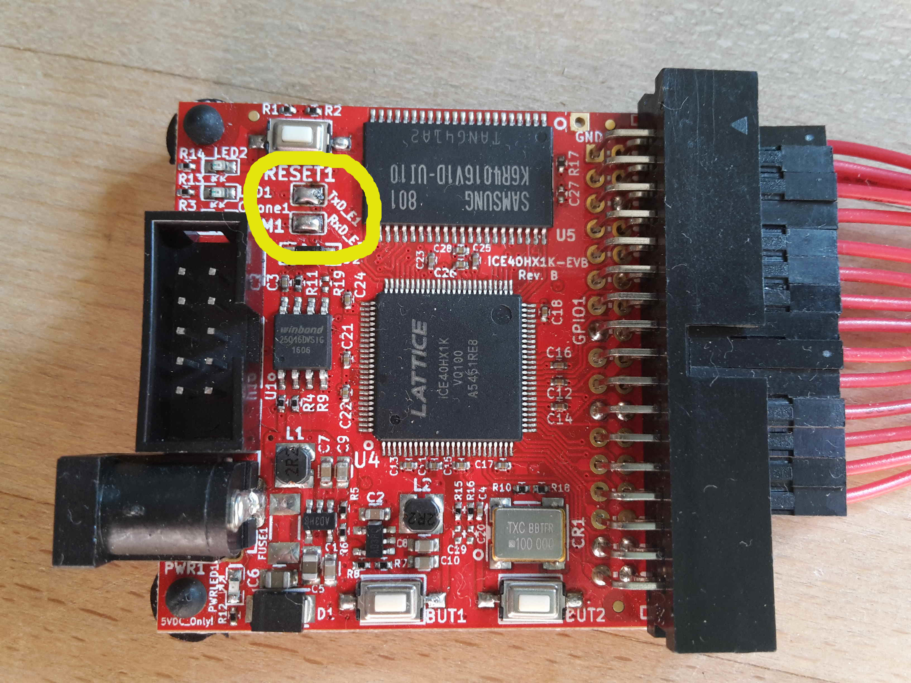

# Project 2: Hack2-UART
## Scope
We will add UART-RX and UART-TX modules to hack. This gives more powerful I/O, as we can communicate bytewise to HACK at runtime. We test UART with little assembler programm `echo.asm`. Finally we implement `Uart.jack` which will be part of our little OS. This will be first test of Virtual Machine running in real hardware.

## Phyical requirement (outside FPGA)
The programmer olimexino 32u4 works in two different mode:
* Mode 1 (yellow led on): programmer of iCE40-board. Used with iceprogduino.
* Mode 2 (green led on): UART Bridge to iCE40 chip. Use with terminal programm (e.g. screen on linux).

To switch between the modes press the hardware button on olimexino 32u4 (HWB).

**Note:** To connect rx and tx lines of UEXT-connector with iCE40-chip on iCE40-HX1K-EVB find the solder-jumper-pads near the UEXT connector (refer to [datasheets/iCE40HX1K-EVB](../datasheets/iCE40HX1K-EVB_Rev_B.pdf)) and solder them  together as in foto below. This step is not necessary on iCE40-HX8K-EVB.

|wire|iCE40HX1K (FPGA)|iCE40HX1K-EVB (UEXT)|
|-|-|-|-|
|RX|36|3|
|TX|37|4|

### Layer 2: Hardware (inside FPGA)
* Build and test the switch [`Switch`](Switch).
* Build and test the shiftregister [`ShifterR`](ShifterR).
* Build and test the module [`UartRX`](UartRX).
* Build and test the module [`UartTX`](UartTX).

### Layer 3: Computer Architecture
* Build [`Hack2`](Hack2) with extender memory map:

 |address | memory|R/W|function|
 |-|-|-|-|
| 8194    | UART-TX|R|-1 = busy, 0 = ready|
 | 8194    | UART-TX|W|write char to be send|
 | 8195    | UART-RX|R|>=0 received byte, <0 busy|
 | 8195    | UART-RX|W|write -1 to clear buffer|
 
### Layer 4: Assembler

* Simulate and test [`asm/echo`](asm/echo) in real hardware.
* Simulate and test [`asm/buffer`](asm/buffer) in real hardware.

### Layer 5: Jack-OS

* Implement and test [`jack/echo`](jack/echo) in real hardware on `Hack2`.

## Conclusion

We can communicate bytewise with Hack at runtime!