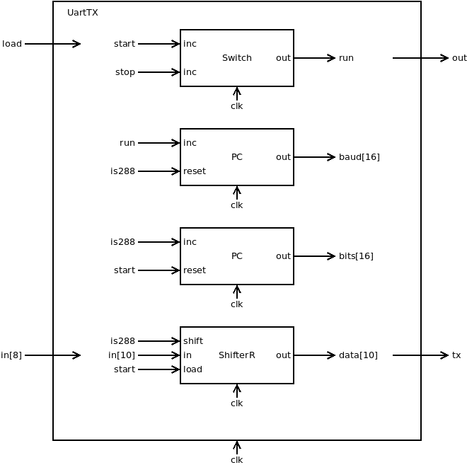
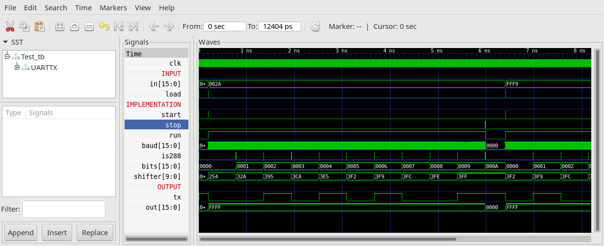

## UartTX.v
Uart_tx controls transmission of bytes over UART.

If (load == 1) & (run == 0) Uart_tx starts transmission:
1. set out = -1 (16 bit)
2. serial output in[7:0] to tx: 1 startbit (0), 8 databits(LSB...MSB) and 1 stopbit(1) with 115200 Baud (bits per second)

At end of transmission set out = 0

### Proposed implementation
* Use a switch to store run-state. run starts, when load==1 and run==0. run stops, when last bit is transmitted.
* When run==1 a Counter increments every clock cycle. After 288 clock cycles the Counter resets.
* A second counter count the transmitted bits.
* A Shiftregister stores in[8] plus a start(0) and a stop(1) bit at start. Then every 288 clock cycles (overflow of counter 1) the shiftregister shifts out the least significant bit (LSB).

## UartTX_tb.v
Testbench, that starts transmission of bytes.

## Project
* Implement UartTX.v
* Test with testbench UartTX_tb.v
* Compare timing diagram with `UartTX_tb.png`
