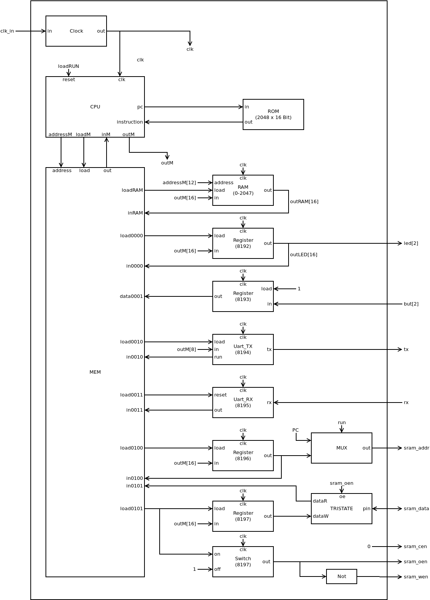
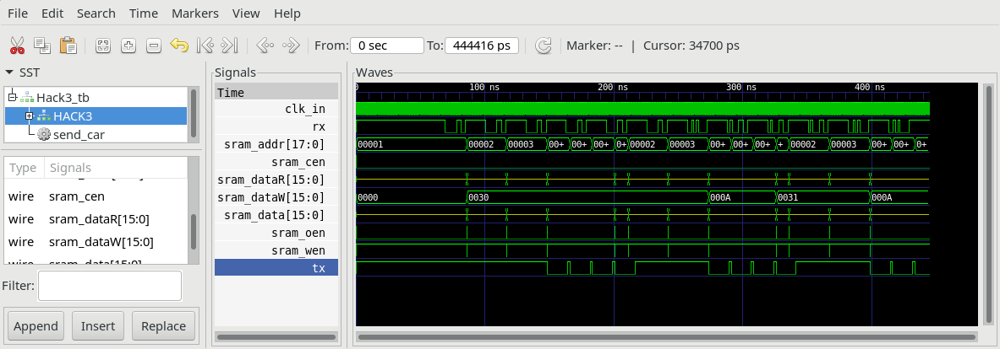

## Hack3.v
Hack3 adds two Registers, that store the address (SRAM_ADDR) and the data (SRAM_DATA) of the next operation to external SRAM. A Switch controls the control lines (sram_oen, sram_wen).

SRAM_ADDR is continuosly connected to sram_addr. SRAM_DATA is connected over a tristate buffer controlled by loadSRAM to sram_data. loadSRAM is generated from a Switch which is also mapped to memory of hack.

### Memory Map

 |address | memory|R/W|function|
 |-|-|-|-|
 |0-2047  | RAM|R/W|R0--R15, static, stack, heap|
 | 8192    | but|R/W|0 = button pressed, 1 = button released|
 | 8193    | led|R/W|0 = led off, 1 = led on|
 | 8194    | UART-TX|R|-1 = busy, 0 = ready|
 | 8194    | UART-TX|W|write char to be send|
 | 8195    | UART-RX|R|>=0 received byte, <0 busy|
 | 8195    | UART-RX|W|write -1 to clear buffer|
 |8196|r_sram_addr|R/W|SRAM address for next operation|
 |8197|r_sram_data|R|SRAM data at selected address|
 |8197|r_sram_data|W|start write procedure|

## Tristate.v
Tristate Buffer (16 bit)

if (oe == 1) dataW is output to external pins, dataR = dataW

if (oe == 0) pins are set to High-Z, dataR = external pins

**Note:** This module is primitive and must not be implemented. It controlles the tristate buffers integrated in the iCE40-chip.

## Hack3.pcf
Consult datasheet of iCE40-HX1K-EVB to find pin numbering of iCE40 connected to SRAM. Add pin numbering to physical constraints file `Hack3.pcf`.

## Hack3_tb.v
The Testbench `Hack_tb.v` transmitts a few bytes to rx. When ROM.v is loaded with `sram.asm` you should be able to see writing and reading of sram.

## Project

* Implement `Hack3.v`
* Add pin numbering to `Hack3.pcf` according to schematic of iCE40HX1K-EVB.
* Preload `ROM.v` with `sram.hack`
* Simulate with testbench `Hack3_tb.v`  
`$ apio sim`
* Compare output with `Hack3_tb.png`
* Build and upload to iCE40-HX1K-EVB  
 `$ apio upload`
* Test `sram.hack` running on fpga with a terminal programm.
  
  `screen /dev/ttyACM0`
