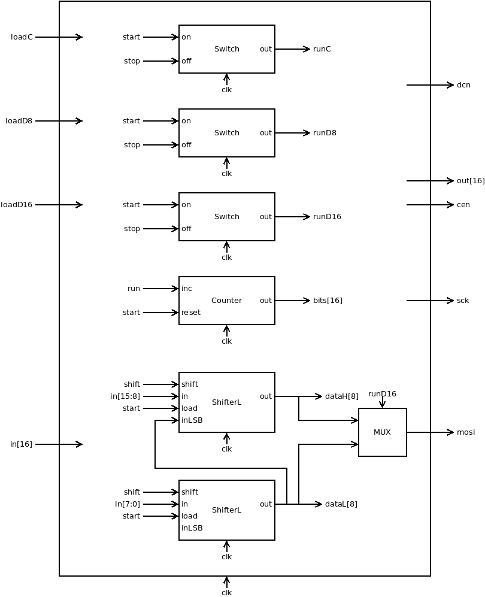
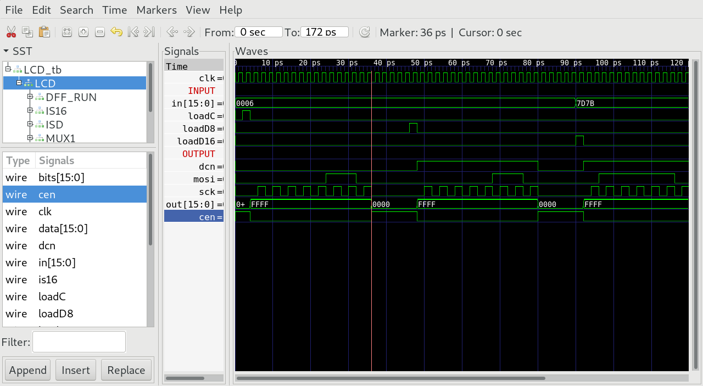

## LCD.v
LCD controls transmission to driver chip ILI9341V of LCD-Screen according to timing diagramm of SPI (serial peripherial interface).

* If (loadC == 1) & (run == 0) LCD starts serial transmission of 8 bits in[7:0] setting dcn = 0 (command).

* If (loadD8 == 1) & (run == 0) LCD starts serial transmission of 8 bits in[7:0] setting dcn = 1 (data).

* If (loadD16 == 1) & (run == 0) LCD starts serial transmission of 16 bits in[15:0] setting dcn = 1 (data).

* During transmission out = -1 (16 bit)
* At end of transmission out = 0 (16 bit)

* During transmission cs = 0
* At end of transmission cs = 1

### Proposed implementation (draft)
* Use a three switch to store run-state (runC, runD8, runD16). run starts, when load==1 and run==0. run stops, when last bit is transmitted.
* When run==1 a Counter increments every clock cycle.
* Two  8 bit Shiftregisters (High and Low part of in) store in[16] bit at start.
* On even counts the shiftregister shifts out the most significant bit (MSB).
* Accorging to runD16 the MSB of dataH or dataL is output to mosi.
* Accorging to runC|runD8|runD16 output to cs and out[16]

## LCD_tb.v
Testbench, that starts transmission of:
1. a 8 bit command (loadC)
2. a 8 bit data (loadD8)
3. a 16 bit data (loadD16)

## Project
* Implement `LCD.v`
* Test with testbench `LCD_tb.v`  
`$ apio sim`
* Compare timing diagram with `LCD_tb.png`
