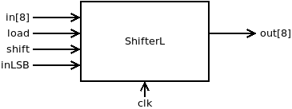
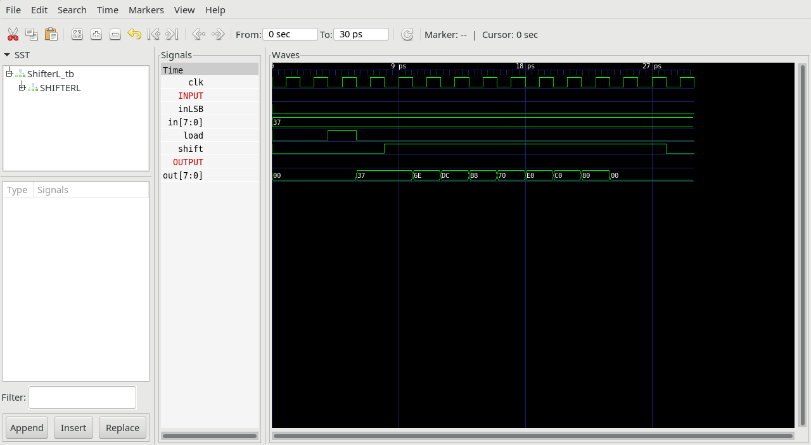

## ShifterL.v

8 bit Shiftregister used by serial peripherial interface (SPI) of modules LCD, SD and Touch.

if (load == 1) out[t+1] = in[t]

else if (shift == 1) out[t+1] = out[t] shifted one bit to left with inLSB shifted in the register as least significant bit.

### Proposed implementation
Use 8 1-Bit Registers `Bit.v` and some `Mux`.

## ShifterL_tb.v
Testbench, that loads 8 bits into the register and then shifts them to the left.

## Project
* Implement `ShiterL.v`
* Test with testbench `ShifterL_tb.v`
* Compare timing diagram with `ShifterL_tb.png`
