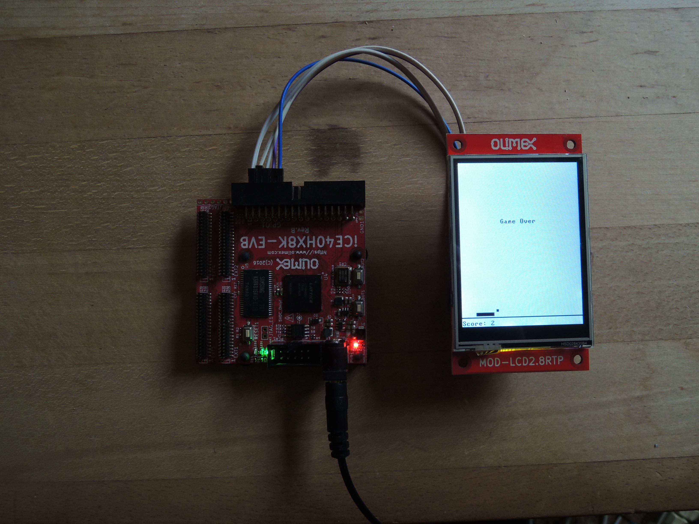

## Pong
We are now ready to play pong. We will use buttons on iCE40-HX1K-EVB board as input.

## Project
* run `Hack6.v` in real hardware with `asm/boot` preloaded to `ROM.v`
* add all needed Jack-OS classes to project folder.
* compile `Pong`
* upload to Hack
* play pong!

