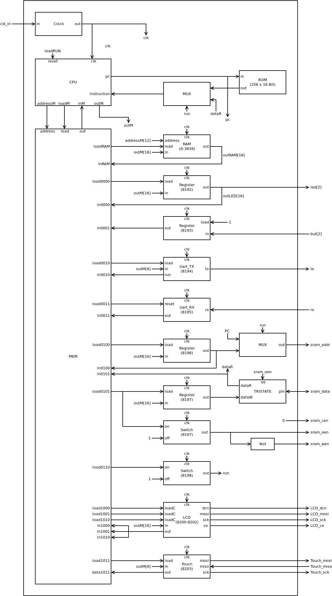
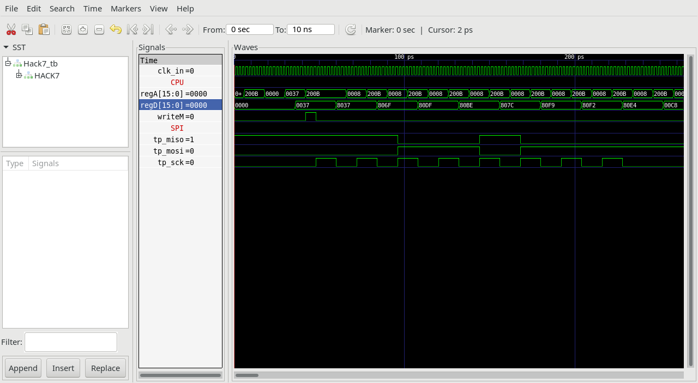

## Hack7.v
Writing to memory address 8203 sends the lower 8 bits to Touchpanel. Reading from memory address 8203 returns -1 if Touchpanel module is busy else the last received byte is returned.

### Memory Map

 |address | memory|R/W|function|
 |-|-|-|-|
 |0-3839  | RAM|R/W|R0--R15, static, stack, heap|
 | 8192    | but|R/W|0 = button pressed, 1 = button released|
 | 8193    | led|R/W|0 = led off, 1 = led on|
 | 8194    | UART-TX|R|-1 = busy, 0 = ready|
 | 8194    | UART-TX|W|write char to be send|
 | 8195    | UART-RX|R|>=0 received byte, <0 busy|
 | 8195    | UART-RX|W|write -1 to clear buffer|
 |8196|r_sram_addr|R/W|SRAM address for next operation|
 |8197|r_sram_data|R|SRAM data at selected address|
 |8197|r_sram_data|W|start write procedure|
 |8198|boot|W|start boot procedure|
 |8200|LCD-C|W|write 8bit command to LCD|
 |8201|LCD-D8|W|write 8bit data to LCD|
 |8202|LCD-D16|W|write 16bit data to LCD|
 |8200-8202|LCD|R|0 = ready, (<0) busy|
 |8203|Touch|W|write 8bit data to Touchpanel|
 |8203|Touch|R|last received byte, or (<0) if busy|

 
## Hack7_tb.v
The Testbench `Hack7_tb.v` performs the following tasks:
* writes data: 55 to MOSI
* MOSI is inverted to MISO, so ~55 should be received.

## Project

* Implement `Hack7.v`
* Preload `ROM.v` with `asm/touch/touch.hack`
* Simulate with testbench `Hack7_tb.v`  
`$ apio sim`
* Compare output with `Hack7_tb.png`
* Connect Touchpanel controller of MOD-LCD-2.8RTP to iCE40-HX1K-EVB with three more jumper wires.
* Preload `ROM.v` with `asm/boot/boot.hack`
* Build and upload to iCE40-HX1K-EVB  
 `$ apio upload`
* Run `boot.hack` on Hack7 in real hardware.
* Do software part of project `jack/TouchTest`
  