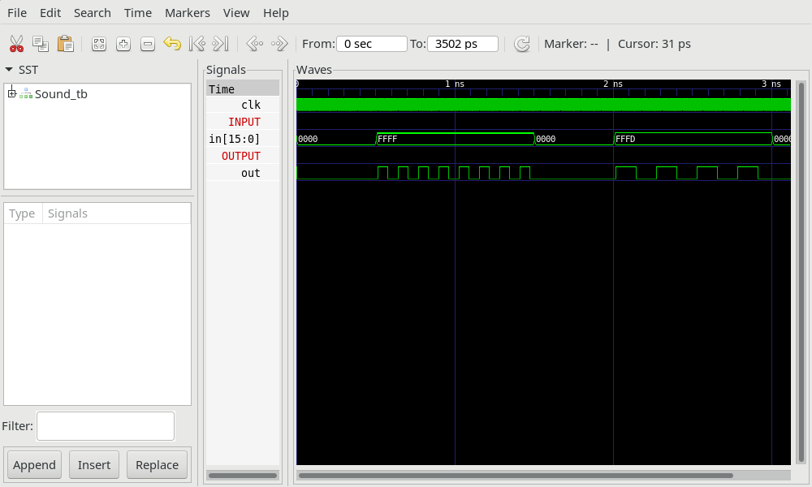

## Sound.v

`Sound.v` generates a square signal whith frequency depending on the input in[15:0].

Implementation: use two counters:

1. a prescaler with 4 bits to have an ovf-signal every 16 cycles

2. a counter which increments every 16 cycles (ovf of prescaler)

when counter2  ovfs:
1. counter2 is preloaded with in, and
2. out toggles

this way out generates a square signal with frequency dependending on in[15:0].

when in=0 out = 0 (mute)

## Sound_tb.v
Testbench.

	
## Project
* Implement the module Sound.v and all needed submodules.  
**Note:** DFF and Nand are considered primitive and thus there is no need to implement them.
* Simulate your implementation with the supplied testbench `Sound_tb.v`.
* Verify by comparing with screenshot of `Sound_tb.png`.